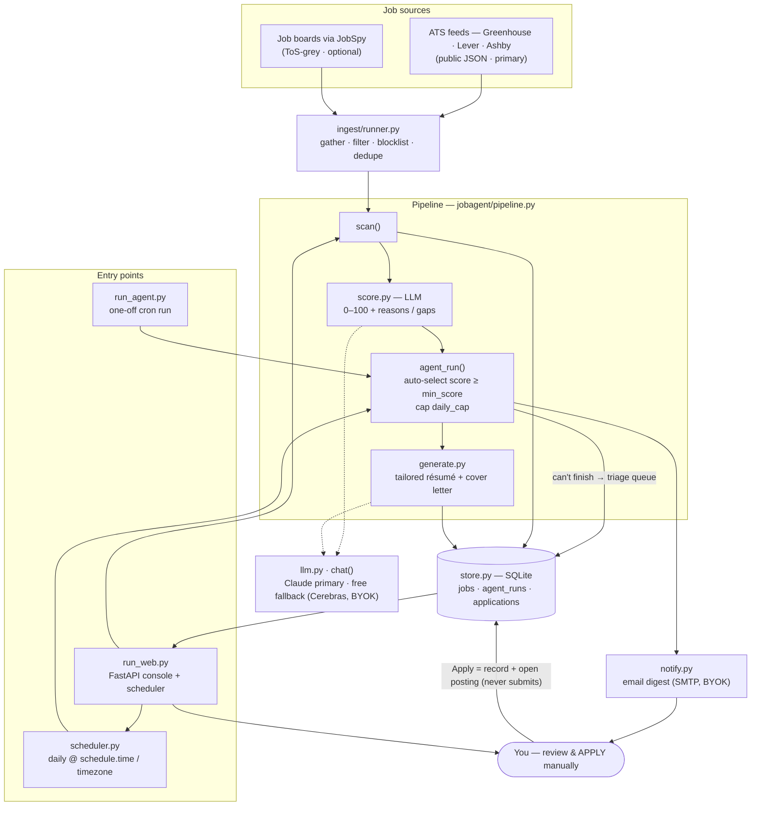

# job-agent-autopilot

**An autonomous job-application prep agent — with a human at the apply button.**
On a schedule (or on demand) it scans company job feeds, scores each role against *your*
profile with an LLM, **auto-selects the best matches, and auto-generates a tailored résumé +
cover letter** for each — then emails you a digest. You review in a web console and apply
yourself. It never submits an application for you.


[](LICENSE)
[](https://github.com/zeyadelganainy/job-agent-autopilot/actions/workflows/ci.yml)

```
scan ─► score ─► auto-pick best ─► auto-generate docs ─► email digest + console ─► you apply
```

Designed to run **always-on for free** on a small cloud VM, so the daily run happens whether or
not your laptop is on. Your résumé/profile and API keys stay in your own deployment.

> V2 of [job-agent](https://github.com/zeyadelganainy/job-agent) (human-driven: Telegram digest →
> you `/pick` → it generates). This repo is the autonomous, **email-only**, self-hosted evolution.

---

## What it does

- 🔎 **Finds roles** from company ATS feeds (Greenhouse / Lever / Ashby) — public JSON, no scraping.
- 🧠 **Scores** each role 0–100 against your profile with an LLM (reasons + gaps).
- 🤖 **Prepares automatically** — for matches at/above your `min_score` (up to a daily cap), it
  writes a tailored résumé + cover letter into *your own* `.docx` template, in *your* voice.
- 🛟 **Flags what it can't finish** — an LLM quota/API error, or a posting behind a manual portal
  (Workday/Taleo/iCIMS/…), lands in a **triage queue** for you, never silently dropped.
- 📧 **Emails you a digest** each run (what's ready to apply, what needs attention).
- 🖥️ **Monitoring console (“JobPilot”)** — today's stats, a Ready-to-apply queue, triage, run
  history, an editable tracker, and analytics; behind a **login page** with a **dark / light theme
  toggle**.
- 🎭 **One-click demo for recruiters** — a “View the demo” button opens a private, **no-live-calls**
  sandbox seeded with sample jobs, documents, and tracker history. Every visitor gets their own
  freshly-seeded copy, so it can't be altered for anyone else, and no LLM/SMTP/network call is made.
- 🗂️ **Tracks applications** — import your spreadsheet, see how many are still **active**, and let
  stale "Applied" rows **auto-ghost** after a configurable number of weeks.
- ✅ **You apply** — the Apply button records the application and opens the posting; it never submits.

## Engineering highlights

- **Autonomous, but safe by design** — auto-prepares; the human always submits. "Apply" only
  records the application + opens the posting.
- **Triage / release valve** — failures (quota/API) and manual-portal jobs are flagged with a
  reason and a Retry / Apply / Dismiss action.
- **Resilient LLM layer** — Claude primary, a free OpenAI-compatible fallback (default Cerebras, BYOK),
  exponential-backoff retry, and clear provider-named error messages ("Fallback: rate limit or quota exhausted").
- **Template-faithful generation** — fills your real résumé `.docx` (fonts, margins, two-column
  layout, clickable links) from a single source-of-truth file; never invents links; fills a full
  page; orders projects most-recent-first. Cover letters are longer, confident-not-arrogant, and
  aligned to the company's stated values.
- **Login + isolated recruiter demo** — a session-cookie login page (HTTP Basic is still accepted
  for scripts/tests); the demo runs entirely on premade data, intercepts every live action, and
  gives each visitor a private, freshly-seeded SQLite sandbox that never touches your real data.
- **Always-on for $0** — deploy assets for an Oracle Cloud Always Free VM (systemd + Caddy HTTPS),
  with Python provided by [`uv`](https://docs.astral.sh/uv/) so it works even on older distros.
- **Responsive, themed, no-build UI** — FastAPI + Jinja + a little vanilla JS / Chart.js; a
  dark-by-default design system with a persisted light-mode toggle, a mobile hamburger-drawer nav,
  and custom toast / confirm dialogs (no native browser prompts). SQLite for state.
- **Config-driven & tested** — everything in `config.yaml`; hermetic `pytest` suite (100+ tests) in CI.

---

## Architecture



**The loop:** sources → `ingest/runner` gathers, filters and dedupes → `pipeline.scan` persists new
jobs → `score.py` rates each against your profile via `llm.chat` → `agent_run` auto-selects matches
at/above `min_score` (capped by `daily_cap`) and calls `generate.py` for a tailored résumé + cover
letter → `notify.py` emails the digest. Anything the agent can't finish (LLM quota/API error or a
manual portal) is flagged into the **triage queue** instead of being dropped. The web console and the
daily scheduler both live in `run_web.py`; `run_agent.py` is the cron-friendly one-off. **You** always
perform the final apply.

---

## Setup (local)

### 1. What you need
- **Python 3.10+**
- At least one **LLM API key**: [Claude](https://console.anthropic.com/settings/keys) (paid, reliable
  — recommended for the agent) and/or a free OpenAI-compatible fallback — default
  [Cerebras](https://cloud.cerebras.ai) (~1M free tokens/day; also works with Groq, OpenRouter, etc.).
- An **SMTP mailbox** for the digest (e.g. Gmail with an App Password).

### 2. Install
```bash
pip install -r requirements.txt
```

### 3. Secrets — copy `.env.example` to `.env` (gitignored) and fill in
```ini
ANTHROPIC_API_KEY=        # leave blank to run on the free fallback only
FALLBACK_API_KEY=your_cerebras_key   # free fallback (default provider: Cerebras)
# FALLBACK_BASE_URL=      # optional: override to use Groq / OpenRouter / etc.
WEB_USERNAME=admin
WEB_PASSWORD=choose-a-strong-password
SESSION_SECRET=        # optional: signs the login cookie (defaults to WEB_PASSWORD)
# Email digest (Gmail: smtp.gmail.com / 587 / an App Password)
SMTP_HOST=smtp.gmail.com
SMTP_PORT=587
SMTP_USER=you@gmail.com
SMTP_PASS=your_app_password
EMAIL_FROM=you@gmail.com
EMAIL_TO=you@gmail.com
APP_URL=                  # your dashboard URL, used in the email link
```

### 4. Your profile (`profile/`, gitignored — personal data)
| File | Used for | What to put in it |
|------|----------|-------------------|
| `profile/profile.yaml` | scoring every role | a compact, structured CV (sent on every score call) |
| `profile/master.md` | generating documents | your full "source of truth" — every role, bullet, metric |
| `profile/samples/` | the cover-letter voice | 1–3 past cover letters or a bio (`.txt`/`.md`) |
| `profile/resume.docx` | the résumé's look | your real résumé; output reuses its fonts/margins/layout |

### 5. Targets + automation (`config.yaml`)
Set `search.keywords` / `locations`, your ATS company tokens under `sources.ats`, then the
**agent**, **tracker**, and **schedule** knobs:
```yaml
agent:
  enabled: true     # scheduled runs do the full auto cycle
  min_score: 80     # auto-generate only at/above this match score
  daily_cap: 5      # max documents auto-generated per run (LLM-cost guard)
tracker:
  auto_ghost: true        # auto-mark still-"Applied" apps as "Ghosted"…
  ghost_after_weeks: 4    # …once they're this many weeks old with no response
schedule:
  enabled: true
  time: "08:00"
  timezone: America/Vancouver
```
(All of these are also editable from the **Settings** page.)

### 6. Run it
```bash
python run_web.py     # the console + the in-process daily scheduler
# or, one autonomous run from the CLI (cron-friendly):
python run_agent.py
```
Open the console, **log in** with your `.env` credentials (or click **View the demo** to explore a
no-live-calls sandbox), and click **Run agent now**. Use the topbar toggle to switch dark / light.

---

## The console
Branded **JobPilot**, behind a login page (session cookie; HTTP Basic also accepted), with a
dark / light theme toggle and a recruiter **demo mode**.

- **Dashboard** — today's Scanned / Matched / Prepared / Applied / Needs-attention (counted in your
  configured timezone); a **Ready to apply** queue (download docs, Apply, Dismiss); a **Needs
  attention** triage queue (Retry / Apply / Dismiss); recent run history; a live next-run countdown;
  **Run agent now**.
- **Jobs** — manual control: filter / sort / paginate (top & bottom), generate or remove; each job
  title links to its posting.
- **Generate** — paste a JD or an ATS URL → tailored résumé + cover letter.
- **Docs** — every generated document, searchable, paginated, with downloads.
- **Tracker** — editable application history (CSV import from Google Sheets), sortable, paginated,
  with an **Active** count and automatic ghosting of stale "Applied" rows.
- **Insights** — applications over time, by stage, and agent activity (documents prepared vs.
  applications you made).
- **Settings** — edit search / scoring / agent / tracker / schedule config (written back to
  `config.yaml`), plus an email-configured indicator.

---

## Deploy always-on (Oracle Cloud Always Free)
A single always-on VM runs the console **and** the daily agent for $0.

1. Create an **Always Free Ubuntu** VM with a public IP. Open ingress for ports **80** and **443**
   in the VCN security list — **and** on the VM open the host firewall (Oracle's Ubuntu image blocks
   everything but SSH by default):
   ```bash
   sudo iptables -I INPUT 5 -m state --state NEW -p tcp --dport 80 -j ACCEPT
   sudo iptables -I INPUT 5 -m state --state NEW -p tcp --dport 443 -j ACCEPT
   sudo netfilter-persistent save
   ```
2. Point a free [DuckDNS](https://www.duckdns.org) subdomain at the VM's public IP.
3. On the VM: `git clone … && cd job-agent-autopilot && bash deploy/install.sh`
   (installs Caddy + `uv`, then a managed **Python 3.11** venv and the dependencies).
4. From your laptop: `./deploy/sync-secrets.sh ubuntu@<vm-ip>` to push `.env` + `profile/`
   (these stay out of the public repo).
5. Edit `deploy/Caddyfile` with your domain → `sudo cp deploy/Caddyfile /etc/caddy/Caddyfile && sudo systemctl reload caddy`.
6. `sudo cp deploy/jobagent.service /etc/systemd/system/ && sudo systemctl daemon-reload && sudo systemctl enable --now jobagent`.

Caddy provisions automatic HTTPS; the console sits behind a login page (a session cookie signed with
`SESSION_SECRET`, falling back to `WEB_PASSWORD`; HTTP Basic is also accepted) — use a strong
password. The agent's daily run fires from the always-on service and emails you.

**Updating a deployment:** `git pull && uv pip install --python .venv/bin/python -r requirements.txt
&& sudo systemctl restart jobagent`, then re-run `sync-secrets.sh` if your `.env`/profile changed.

## Safety & honest notes
- **Never auto-applies** — a human always does the final submit; "Apply" only records it + opens the posting.
- **ATS feeds are the safe primary source**; job boards (JobSpy) are ToS-grey and can get a cloud IP blocked.
- **Public repo:** secrets and your profile are gitignored and delivered to the VM via `scp`, never committed.
- **LLM reality:** a Claude key gives the most dependable daily operation (with a spend cap if you
  like); the free fallback (default Cerebras, ~1M tokens/day) covers a full autonomous run when
  Claude errors or its key is unset. Point `FALLBACK_BASE_URL` at any OpenAI-compatible provider.
- **Where your data goes:** your résumé is in every prompt. Anthropic doesn't train on API
  inputs/outputs; for the free fallback, check that provider's current data-use policy before sending
  your profile.

## Development
```bash
pip install -r requirements-dev.txt
pytest
```
Tests are hermetic — no network, LLM, or email. See `CLAUDE.md` for architecture and conventions.

## Project layout
```
run_web.py         # web console + in-process daily scheduler
run_agent.py       # one-off autonomous run + email (cron-friendly)
config.yaml        # search, sources, scoring, agent, tracker, models, web, schedule
profile/           # your data (gitignored): profile.yaml, master.md, samples/, resume.docx
jobagent/          # ingest/, score, generate, llm, store, pipeline, notify, scheduler, web/
deploy/            # Oracle Cloud Always Free: install.sh, jobagent.service, Caddyfile, sync-secrets.sh
tests/             # hermetic pytest suite
```
